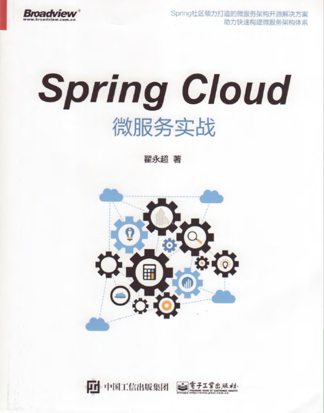

# PDF
一些工作中读过的PDF，对不起作者们，欠你们一本书钱。

网盘链接失效的请发邮件告知我~  [个人邮箱](liuyf126@126.com)

## 一、Java相关

### 1.《阿里巴巴Java开发手册》-2020最新嵩山版

链接：https://pan.baidu.com/s/1xZ-YRQdoKukj87qgPoHYIA 
提取码：p3mv

### 2.《Java语言规范》 基于 Java SE 8 中文

链接：https://pan.baidu.com/s/1sBtnkEDqzgUM-NGh47WypA 
提取码：yuym  

### 3.《Java虚拟机规范  Java SE 8版》

链接：https://pan.baidu.com/s/1BR3tzCk_QpVT4hlJbghE2g 
提取码：vp3x

### 4.《Spring技术内幕》

链接：https://pan.baidu.com/s/1GRbw1zBSZ71iC2pwtZxUhQ 
提取码：n93s

### 5.《深入理解Spring Cloud与微服务构建》

链接：https://pan.baidu.com/s/1TdppU95_4oY6jVxEBHuRTw 
提取码：6rpf  

### 6.《重新定义Spring Cloud实战》

链接：https://pan.baidu.com/s/1ySpyiEofReBYqFfe8xBflw 
提取码：uu7j

### 7.《Java设计模式》(第2版)

链接：https://pan.baidu.com/s/1E3dk-jul3Agr31ApJrK15A 
提取码：hd6m

### 8.《Spring Cloud微服务实战》

链接：https://pan.baidu.com/s/1KHGCf7Oh5ocoSon6x71ABA 
提取码：3qjm

## 二、数据结构与算法

### 1.《大话数据结构》

讲的非常棒，通俗易懂，大学没学会的数据结构在这本书里都得到了解答。

[百度网盘链接](https://pan.baidu.com/s/1meJ3IXo_kVIs2Y-R5RILzg )   提取码：omqf

### 2.《程序员代码面试指南》

左程云左老师著，这本书我买了正版的，上次听过左老师一次公开课，给我听哭了，解题思路太秒了。

[百度网盘链接](https://pan.baidu.com/s/1rW-VEZ-jqf1cZsvUa6Oi3w )  提取码：glqt

### 3.《箭指Offer》

听同事说好像还不错，回头看看。

链接：https://pan.baidu.com/s/1R6TtQDbUaSOKso95yCFbZQ 
提取码：1lbm

### 4.《数据结构与算法Java版》

这本书存在电脑里，自己好像没咋看过，推荐前两本，多看几遍，足够了。

[百度网盘链接](https://pan.baidu.com/s/1umoM8_cfEqSJta01ZeVywg)  提取码：6qbb

## 三、计算机网络

### 1.《TCP/IP详解 第一卷》

这本书是去面试的过程中，结束面试时候一位面试官推荐给我的，感觉他对TCP/IP 协议以及相关的计算机网络知识非常精通。他推荐的，肯定没错。

[百度网盘链接](https://pan.baidu.com/s/1sKSqGQrV-WXPkVbSug88rQ) 提取码：91g5

### 2.《计算机网络》--谢希仁

这本书书也还不错，大学时是作为教材来使用的，毕业后唯一保留着的一本书。

链接：https://pan.baidu.com/s/1AM5h57VHyPpUCkT7F8vgXQ 
提取码：p13r

### 3.《图解HTTP》

这本书也粗略的读过，感觉还不错，对Http的理解提升了一个档次。

链接：https://pan.baidu.com/s/1281K6y0jitPRvEf59lM-2w 
提取码：q57v

### 4.《UNIX网络编程卷-1：套接字联网API》（第3版）

要精通IO NIO的话，这本书还是有必要读一下的。

链接：https://pan.baidu.com/s/1y3aWMqHP4MptFvkATbr7AA 
提取码：zqiv

## 四、计算机组成原理

## 五、中间件相关

### 1.《Redis深度历险：核心原理和应用实践》

链接：https://pan.baidu.com/s/1Crr7LPO_HdVlkyxIuCM5Hg 
提取码：jkas

### 2.《从Paxos到Zookeeper  分布式一致性原理与实践》--倪超

链接：https://pan.baidu.com/s/1CPd8KkeUMlUa3F83MrbdcQ 
提取码：sj49

### 3.《精通nginx》

链接：https://pan.baidu.com/s/18jVY7OKBlfO6ObvUkxesjg 
提取码：2up8

### 《Netty权威指南》--第2版

链接：https://pan.baidu.com/s/1myZcCKWh79upqFiVUewP2Q 
提取码：b8g9

